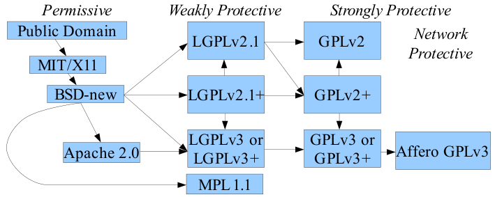

## Static-Attribute

Wichtig bei Attributen: Jedes Objekt hat eine eigene Kopie!

* Sinnvoll bei Eigenschaften des Objekts (ISBN des Buches)
* Aber schwierig, wenn Eigenschaft gemeinsam sein soll

Lösung: Statische Attribute:

* Markierung mittels `static`
* Alle Objekte haben gemeinsamen Wert!

---

## Static-Attribute: Instanzen zählen (+Heap)

```java
public Class Book {
    private int ID;
    public static int numBooks = 0;
    public Book() {
        ID = numBooks;
        numBooks += 1;
    }
    public int getID() { return ID; } 
}
Book book1 = new Book();
System.out.println("Book 1 ID: " + book1.getID())
System.out.println("Total number of books: " + Book.numBooks); //nicht book1.
Book book2 = new Book();
System.out.println("Book 2 ID: " + book2.getID())
System.out.println("Total number of books: " + Book.numBooks);
```

---

## Static-Methoden: Logik kapseln

* Methoden, die keinen Zugriff auf Attribute außer `static` brauchen
* Typisch:
    * Utility-Methoden, die logisch in die Klasse gehören/Utility-Klassen
    * Getter für statische Attribute
    * Konfigurations-Klasse/Globale Werte
* Vorsicht: Sehr situational! Meist ist `static` die falsche Lösung!

```java
public Class Book {
    private static int numBooks = 0;
    public static int getNumBooks() { return numBooks; } // kann static sein
}
```

---

## Externe Libraries

* Viele Leute haben ähnliche Probleme
* Immer das Rad neu zu erfinden ist ineffizient - "Wir stehen auf den Schultern von Giganten"
* Lösung in Programmierung: Bibliotheken ("Libraries")
    * Eigenen Code so verpacken, dass er einfach nachnutzbar ist
    * Fremde Libraries verwenden, wenn sinnvoll möglich
* In Java: JAR-Dateien

---


## Libraries: Sicherheit

* Nicht alle programmieren gut
* Projekte sind oft "Hobbies"
* Einige Kriterien:
    * Größe der Community
    * Verwendung in Projekten
    * Umgang mit issues (insbesondere security)
* Manchmal muss man das Rad doch neu erfinden...

---

## Libraries: Lizenzen

* Open Source vs. Closed Source
* Copyleft vs. Copyright
* Kompatibilität (-> immer eigene Lizenz setzen)!



---

## Letzte (Verständnis-)Fragen

* Jetzt Möglichkeit, noch offene Fragen vor der Prüfung zu klären!
* Ansonsten Programm für restliche Zeit:
    * Live gemeinsam Arbeit mit XChart anschauen
    * Was anderes zusammen anschauen?