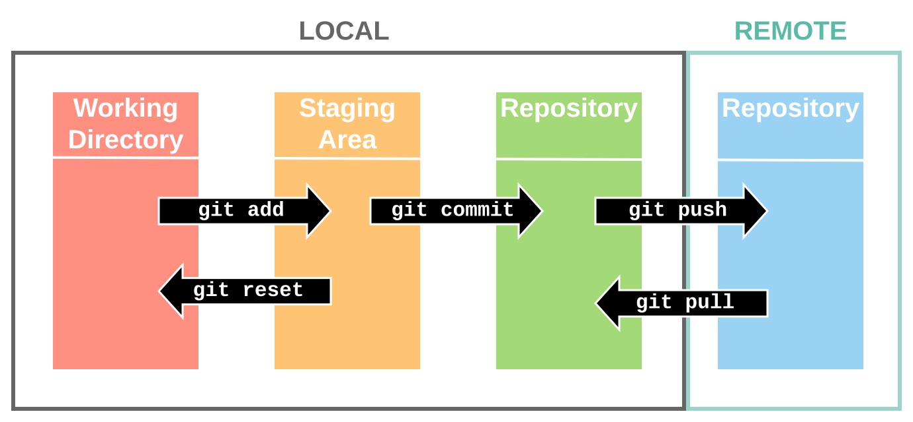
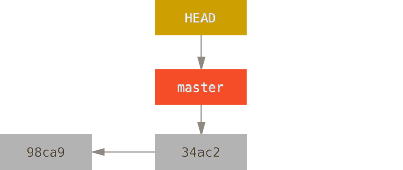
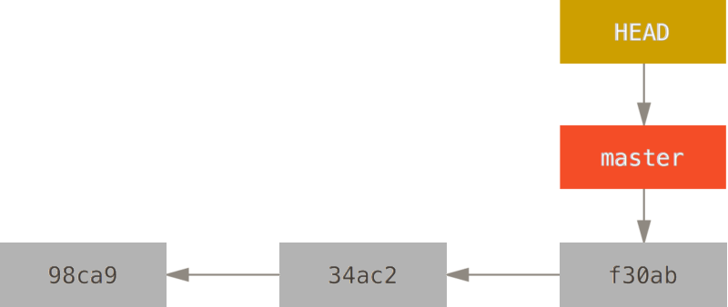

# Erinnerung!

Die Vorlesung besteht aus mehreren Teilen!
* Vorlesung: Theoretische Hintergrundinformationen
* Übung: Praktische Umsetzung - und häufig mehr Details zu den theoretischen Hintergrundinformationen!
* Skript: Theorie **und praktische Tips** in Textform
* Folien: Enthalten auch **Code-Beispiele**

Bitte **alles** nutzen! Insbesondere vor "Wie mache ich XXX" Materialien lesen, es gibt einen Grund, warum es die gibt!

---

# Programmiersprachen

* Neben Snap!-Blöcken gibt es viele andere Programmiersprachen

```python
vals = [1, 6, 5, 3]
for i in range(0, len(vals)):
    print(vals[i])
```

```c++
#include <iostream>
int vals[4] = {1, 6, 5, 3};
for(int i=0; i<sizeof(vals)/sizeof(int); i+=1) {
    std::cout << vals[i] << "\n";
}
```

---

# Java

* Weit eingesetzte Programmiersprache
* Kümmert sich um Speicherverwaltung (anders als bspw. C)
* Besitzt viele Komfort-Features
* Beliebt auf dem Markt

---

# Erstes Java-Programm

```java
// Jede Klasse muss in gleichnamiger Datei stehen (hier: HelloWorld.java)
// Jeder Java-Code muss in einem Klassen-Block stehen (Begrenzung: {})
public class HelloWorld {
  // Code ist in Methoden unterteilt. Konkrete Anweisungen stehen in 
  // Methoden-Blöcken
  // Spezielle Methode main: Startpunkt eines Programms
  public static void main(String[] args) {
    // System.out.println: Methode, die als Argument das nimmt, was auf dem
    // Bildschirm ausgegeben werden soll
    System.out.println("Hello, world!");
    // Jede Zeile muss mit einem       ; enden
  }
  // Jede geöffnete Klammer muss wieder geschlossen werden
}
```

---

# Variablen in Java

```java
public class HelloWorld {
  public static void main(String[] args) {
    // Variablen (hier: Zahlen) deklarieren und initialisieren
    int i = 0;
    int k = 3;
    // Wert von i um 1 erhöhen
    i ++;
    // Mathematische Operationen (hier: +, * und Modulo)
    i = (k + 3*i) % 2;
    System.out.print(i);
  }
}
```

---

# Funktionen in Java

```java
public class HelloWorld {
  // Definition einer eigenen Funktion mit 2 Argumenten
  public void printNumbers(from, to, by) {
    for(int i=from; i<to; i+=by) {
      System.out.println(i);
    }
  }

  public static void main(String[] args) {
    // Aufruf der Funktion (Ausführung des Codes darin)
    printNumbers(1, 12, 2);
  }
}
```


---

# Programmcode im Speicher

Der Computer kann aber keinen Code, nur Zahlen...?

| Befehl | Wert | Argumente | Kommentar |
|---|---|---|---|
| print | 1 | 1 | Auszugebende Adresse |
| jeq | 2 | 3 | 2 Adressen verlgeichen, 3: Sprungziel |
| add | 3 | 2 | 1: Adresse, 2: Zu addierender Wert |
| jmp | 4 | 1 | Sprung-Adresse |
| put | 5 | 2 | 1: Adresse, 2: Wert |


---

# Programmcode -> Bytecode
```java
for(int i=0; i<10; i++) {
  System.out.print(i);
}
```

```asm
90: put 69 0          
93: put 68 10
96: jeq 69 68 107
100: print i
102: add i 1
105: jmp 96
107: Programmende (0)
```

* Programm: `90: 5 69 0 5 68 10 2 69 68 107 1 69 3 69 1 4 96 0`

---

<!--
_footer: ""
-->

<style scoped>
table {
  font-size: 20px;
}
</style>

# Speicherorganisation: Stack

* Eigener Speicherbereich für jede Funktion, pro Aufruf neu
* Variablen der Funktion werden dort angelegt/übergeben
* `printNumbers(0, 100, 2)` könnte ergeben:

| Adresse | Wert | Kommentar | 
|---|---|---|
| 12 | ... | Nächster Befehl |  
| ... | ... | Anderer Code etc.| 
| 67 | 12 | Rücksprung-Adresse | 
| 68 | 2 | by (Arg. 3) |
| 69 | 100 | to (Arg. 2) | 
| 70 | 0 | from (Arg. 1) | 
| 71 |... |Rücksprung-Adresse vorherige Funktion |
| ... | ... | Restlicher Stack | 

---

# Scope

Scope ergibt sich aus Stack:
* Funktionen verändern nur ihre eigenen Werte!
* Funktionen kriegen nur Kopien der Argument-Werte!

```java
void printNumbers(from, to, by) {}
  for(; from<to; from += by) {
    System.out.println(from);
  }
}
from = 0;
printNumbers(from, 100, 2);
System.out.println("From: " + from); // Gibt das 0 oder 100 aus?
```

---

# Speicherorganisation: Datentypen

* Bisher angenommen: Ein Wert = eine Speicheradresse
* Aber: Eigentlich kann der Computer nur 1 und 0 (bit)
* Definierte Breite einer Zahl: 8 bit = 1 byte -> 0 - 255
* Was tut man, um: 
  * Zahlen kleiner 0 zu speichern?
  * Zahlen größer 255 zu speichern?
  * Gelitkommazahlen zu speichern?
  * Buchstaben zu speichern?
* 10 Minuten, Gruppen (durchzählen für Themen)
---

# Negative Zahlen: Zweierkomplement 

* Einfache Lösung: Erstes bit ist Vorzeichen (z.B. 3 = `0011`, -3=`1011`)
* Probleme: 
  * 0 "doppelt" (`0000`, `1000`)
  * Addition schwierig (z.B. `0011+1011=1110`=-6?)
* Zweierkomplement: Erstes bit ist -1*Max. (z.B. -8=`1000`, -5=`1011`)
* Vorteile:
  * 0 nur ein Mal (`0000`, `1000`=-8)
  * Einfache Addition (z.B. `0101+1011=0000`)
---

# Zahlen größer als 0

* Mehrere bytes zu einer Zahl zusammengefasst
* Architekturabhängig, wie "breit" Zahlen sind
* Java macht es einheitlich:
  * `byte`: 1 byte -> [-128, 127]
  * `short`: 2 byte -> [-32768, 32767]
  * `int`: 4 byte -> [-2147483648, 2147483647]
  * `long`: 8 byte -> [-9223372036854775808, 9223372036854775807]
  * Optional `unsigned` -> kein Zweierkomplement, höherer Maximalwert

---

# Gleitkommazahlen

* Aufteilung der Zahl: Exponent, Mantisse
* Wert=Mantisse^Exponent
* Gleitkommazahlen sind nur Näherungswerte!
  * Für kleine Werte: Extrem gute Näherung
  * Je größer der Wert, um so geringer die Genauigkeit
  * Spezielle Bibliotheken für genaue Berechnungen mit großen Zahlen

---

# Text

* Interpretation von Zahlen als Buchstaben
* ASCII-Tabelle: Zuordnung der Werte eines byte zu Zeichen
* Problem: Unterschiedliche Alphabete
* Lösungen:
  * Codepages - aber nicht automatisch erkennbar
  * UTF-8: Ein Buchstabe kann bis zu 4 Zeichen breit sein, Erkennung über erstes bit.

---

# Speicherinterpretation: Datentypen

Was bedeutet `01001000 01101001`?
* Zwei `byte`: 72, 105?
* Ein `short`: 18537?
* Zwei `char`: "H", "i"?

-> Datentypen müssen in Java deklariert werden und **ändern die Bedeutung** von Variablen - z. B. `00110111` kann die Zahl 55 oder das Zeichen "7" sein (aber niemals die Zahl 7)! 

---


# Versionskontrolle

* Ziel: Kontrolle!
    * 1972: [SCCS](https://en.wikipedia.org/wiki/Source_Code_Control_System), single user
* Bonus: Zusammenarbeit
    * 1986: [CVS](https://en.wikipedia.org/wiki/Concurrent_Versions_System) (central)
    * 2005: [git](https://en.wikipedia.org/wiki/Git) (distributed)
    * In the meantime: [SVN](https://en.wikipedia.org/wiki/Apache_Subversion), [TFVC](https://en.wikipedia.org/wiki/Azure_DevOps_Server#TFVC), [BitKeeper](https://en.wikipedia.org/wiki/BitKeeper), [Mercurial](https://en.wikipedia.org/wiki/Mercurial) etc.
* Alles, was textbasiert ist (code, LaTeX, Markdown etc.)

---

# Grundidee von git



---

# Dateien im repo im Zeitverlauf


---

# Wichtige Befehle


* Überblick: [NeSI reference sheet](https://support.nesi.org.nz/hc/en-gb/articles/360001508515-Git-Reference-Sheet)
* Erst `git clone https://repo.git`
* Typischer Workflow danach:
    * `git add file1 file2 ...`
    * `git status`
    * `git commit -m "Habe fertig!"`
    * `git push`
* In case of fire: [Oh Shit, Git!?!](https://ohshitgit.com/)

---

# Frisches Repository


---

# Repository nach einem commit



---

# Repository nach zwei commits



---

# Verständnisübung 

| Befehl | Wert | Argumente | Kommentar |
|---|---|---|---|
| print | 1 | 1 | Auszugebende Adresse |
| jeq | 2 | 3 | 2 Adressen verlgeichen, 3: Sprungziel |
| add | 3 | 2 | 1: Adresse, 2: Zu addierender Wert |
| jmp | 4 | 1 | Sprung-Adresse |
| put | 5 | 2 | 1: Adresse, 2: Wert |

`90: 5 60 0 5 59 2 5 58 100 2 60 58 120 1 60 5 57 0 2 57 59 99 3 60 1 3 57 1 4 108 0`


<!--
90: put 60 0 # i
93: put 59 2 # diff
96: put 58 100 # max
99: jeq 60 58 120
103: print 60
105: put 57 0
108: jeq 57 59 99
112: add 60 1
115: add 57 1
118: jmp 108
120: Programmende
-->

