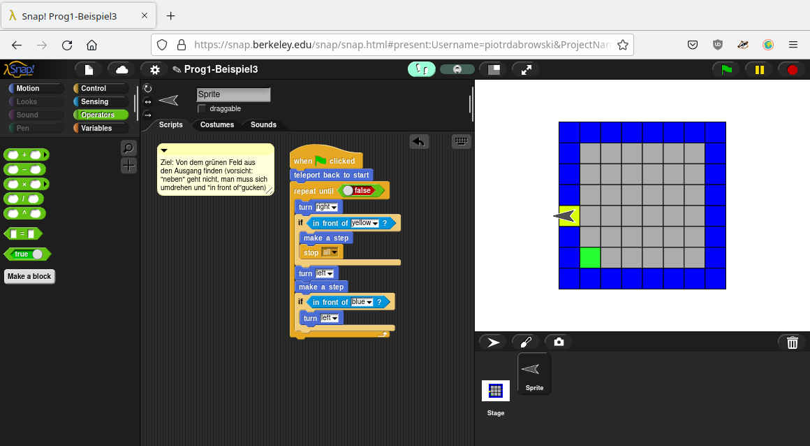
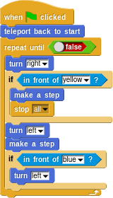
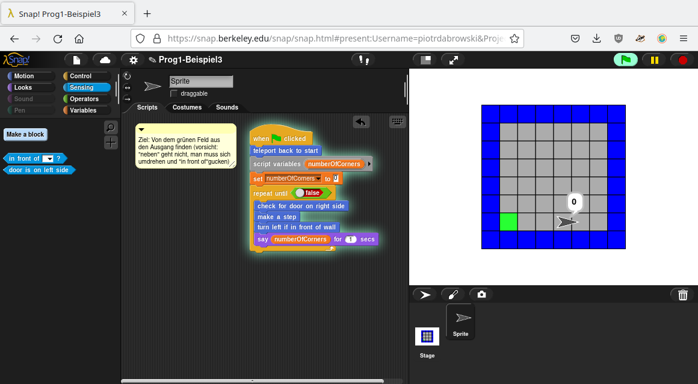
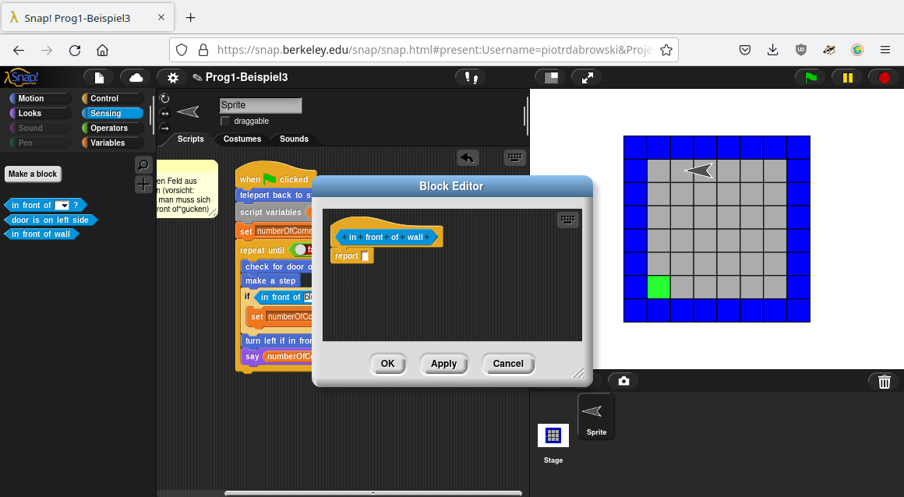
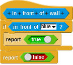
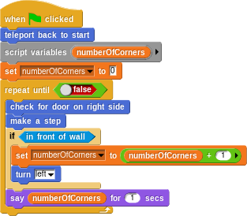
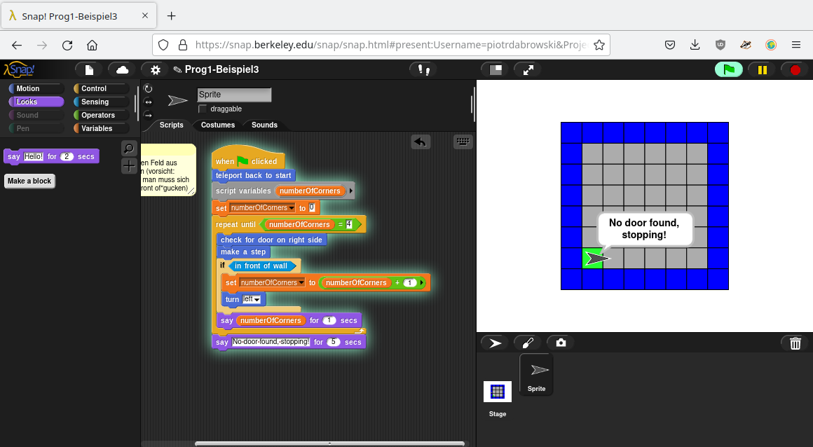
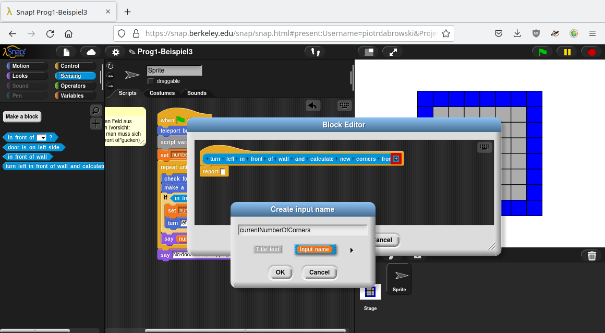
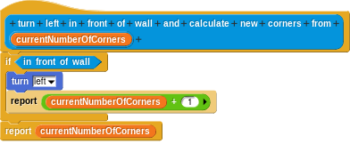
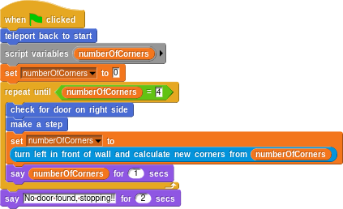

# Einführung in die Programmierung: Teil 2

Mit dem bisher erlangten Wissen können wir einige etwas komplexere Algorithmen entwickeln - und dabei ein paar weitere Blöcke kennenlernen. 

## Eine etwas komplexere Aufgabe

Zunächst schauen wir uns in [Beispiel 3](https://snap.berkeley.edu/project?user=piotrdabrowski&project=Prog1-Beispiel3) eine etwas komplexere Aufgabe an: Hier soll, ausgehend von dem grünen Feld, die Tür gefunden werden (also das gelbe Feld in der blauen Wand). Dabei darf aber die Wand natürlich nicht betreten werden. Also muss in jedem Schritt überprüft werden, ob der Pfeil gerade neben der Wand steht. Da die einzige vorhandene Überprüfung `in front of` ist, sind dafür drei Operationen nötig: Nach rechts drehen, überprüfen ob der Pfeil vor einem gelben Feld steht und, falls nein, wieder nach links drehen. In Snap! sieht das wie folgt aus:

## True und False

Das funktioniert allerdings nur, wenn die Tür an der ersten Wand ist. Um alle Wände abzusuchen, müsste die Schleife 4 Mal hintereinander wiederholt werden, und dawzischen müsste sich der Pfeil jedes Mal nach links drehen. Exemplarisch für die ersten 2 Wände (also nur mit einer Drehung) würde das so aussehen:

Natürlich ist das keine besonders praktikable Herangehensweise. Stattdessen wäre es praktischer, die erste Schleife gar nicht unterbrechen zu lassen und stattdessen sich nur, wenn der Pfeil vor der Wand steht, eine Drehung nach links zu machen. Dafür müsste man eine Bedingung für die Schleife finden, die immer erfüllt ist. Das ließe sich beispielsweise über einen Vergleich erreichen - `repeat until 1=0` würde immer wieder wiederholt werden (das können Sie selber mit dem grünen `=`-Block aus der Kategorie "Operators" ausprobieren). Das funktioniert, denn die Aussage "1=0" ist nie erfüllt, also immer falsch. Einfacher ist es also, direkt den Wert "falsch", in der Englisch-basierten Informatik `false`, zu verwenden (auch diesen Block finden Sie unter "Operators", er lässt sich per Klick zwischen `true` und `false` umschalten um jeweils eine immer erfüllte oder eben eine nie erfüllte Bedingung zu haben). Mit diesem Konzept lässt sich eine Endlosschleife erstellen, mit der der Pfeil immer der Wand entlang läuft, bis er eine Tür findet:

## Definieren eigener Funktionen

Dieses Programm funktioniert zwar an sich, ist aber nicht besonders einfach zu lesen: Wenn Sie einfach nur diesen Codeblock sehen würden:

würde es Ihnen vermutlich recht schwer fallen, nachzuvollziehen, was hier eigentlich passiert. Mit steigender Länge und Komplexität des Programms wird es immer schlimmer. Um dieses Problem zu beheben, und um ein Mal geschriebene Funktionalität immer wieder verwenden zu können, ist es möglich, eigene Funktionen zu schreiben - in Snap! abgebildet als das Erstellen eigener Blöcke. 

Eine Funktion sollte generell eine bestimmte, klar definierte Aufgabe übernehmen. Eine solche Aufgabe in dem Skript zur Suche nach der Tür ist, zu schauen, ob der Pfeil gerade neben der Tür steht (also: umdrechen nach rechts, falls da ein gelbes Feld ist einen Schritt machen und das Programm beenden, sonst wieder nach links umdrehen). Wenn man das alles in einen Block `check for door on right side` auslagern könnte, wäre der Code gleich viel übersichtlicher.

In Snap! kann man eine eigene Funktion definieren, indem man auf den Button "Make a block" unter der Block-Liste links klickt. Dann muss man oben eine Block-Kategorie auswählen (in diesem Fall wäre "Motion" eine sinnvolle Einordnung, aber auch "Sensing" wäre plausibel), dadrunter den Block-Namen eingeben und zuletzt dadrunter den Block-Typ auswählen (in unserem Fall "Command", um die anderen Typen kümmern wir uns später):

Wenn man nun mit OK bestätigt, kann man in dem neu erscheinenden Block Editor definieren, was in der Funktion passieren soll - genau so, wie es in dem Hauptskript auch passiert, nur dass der erste Block nun nicht `when start clicked` ist sondern als "Wenn der Block mit diesem Namen ausgeführt wird" zu verstehen ist. Zu dem Block Editor kommt man übrigens auch, wenn man auf einen selbst definierten Block rechts klickt und "Edit" auswählt.

Nun können wir in dem Block Editor definieren, dass in der Funktion `check for door on lerightft side` genau das passieren soll, was wir in dem Hauptskript getan haben, um nach einer Tür zu schauen:

Nach dem Speichern der Blockdefinition durch Klick auf den "OK"-Button kann der entsprechende Teil des Codes im Skript gelöscht und durch diesen neuen Block (der in der entsprechenden Kategorie, in diesem Beispiel unter "Motion", zu finden ist) ersetzt werden:

Das sieht schon übersichtlicher aus. Das gleiche könnte man auch für die Überprüfung, ob der Pfeil gerade vor der Wand steht und sich entsprechend nach links drehen sollte, tun (also die entsprechenden Anweisungen in einen Block `turn left if in front of wall` auslagern). Dann sieht das Skript so aus:

Hier ist schon eher auf Anhieb erkennbar, was das Skript tun soll.

## Programme mit Erinnerungsvermögen: Variablen

Ein Nachteil dieses Skriptes ist, dass es, falls gar keine Tür vorhanden ist, den Pfeil sich endlos im Kreis drehen lässt (bzw. bis Sie den roten "Stop"-Button oben rechts anklicken). Sie können das gerne mit dem Hintergrund "map3-3" ausprobieren, in dem es keine Tür gibt.

Um das zu vermeiden, müsste das Skript in der Lage sein, mitzuzählen, wie häufig es schon an einer Wand nach links abgebogen ist. Für solche Erinnerungs- und Zählaufgaben werden in Programmen Variablen verwendet: Speicherplätze, an denen man einen Wert abspeichern kann, und die einen Namen bekommen. Über diesen Namen kann man dann auf den gespeicherten Wert zugreifen und ihn verändern. 

Eine neue Variable kann man in Snap! mit dem Block `script variables` aus der Kategorie "Variables" anlegen, den Namen vergibt man indem man auf das orange hinterlegte "a" klickt und einen eigenen Namen vergibt. Den Wert einer Variable kann man mit dem Block `set to` setzen, wobei der Name einer vorher mittels `script variables` definierten Variable in dem drop-down ausgewählt werden kann.

Zudem ist es auch nützlich, ab und zu zu sehen, was der in einer Variable gespeicherte Wert ist. Dafür kann der Block `say` in der Kategorie "Looks" verwendet werden: Der Name der Variable kann einfach aus dem `script variables`-Block in das "Hello"-Feld des `say`-Blocks gezogen werden, und dann zeigt der Pfeil den entsprechenden Wert an.

Mit diesem Wissen bewaffnet ist es schon mal möglich, den ersten Schritt zum Zählen der Ecken zu machen: Eine neue Variable `numberOfCorners` anlegen (diese Schreibweise, in der bei langen Variablennamen der Anfangsbuschtabe von jedem Wort groß geschrieben wird, wird übrigens als "camel case" bezeichnet, da die Großschreibung an die Höker eines Kamels erinnert), den Anfangswert auf 0 setzen, und dann in jedem Schritt eine Sekunde lang den Wert der Variable ausgeben lassen:

Das allein ist allerdings noch wenig hilfreich. Wir müssen, falls der Pfeil vor einer Wand ist, den Wert der Variable um 1 erhöhen. Das lässt sich wieder mit dem Block `set to` in Kombination mit dem `+`-Block aus der "Operators"-Kategorie lösen:

## Funktionen mit Rückgabewert

Unschön ist an dieser Stelle, dass wir 2 Mal überprüfen müssen, ob der Pfeil vor der Wand steht oder nicht: Ein Mal, um die Variable `numberOfCorners` hochzuzählen, und ein Mal in der Funktion `turn left in front of wall`. Eine naheliegende Idee könnte sein, einfach innerhalb von `turn left in front of wall` den Wert der Variable zu erhöhen. Das geht allerdings nicht, da auf eine Variable grundsätzlich nur innerhalb der Funktion zugrgriffen werden kann, in der sie definiert wurde (das wird als scope, also "Gültigkeitsbereich", einer Variable bezeichnet - auf die technischen Hintergründe gehen wir in späteren Wochen ein).

Stattdessen gibt es zwei andere Lösungen. Die erste ist, die Funktion `turn left in front of wall` so zu verändern, dass wir sie in einem `if` verwenden können, um zu sagen: "Wenn du vor einer Wand stehst, dann drehe dich links und erhöhe den Wert von `numberOfCorners` um 1". 

Dafür muss die Funktion aber in der Lage sein, einen Wert - in diesem Fall `true` oder `false` - zurückzuliefern. Dieses Konzept wird als Rückgabewert einer Funktion bezeichnet: Die Funktion führt irgendwelche Berechnungen durch und gibt das Ergebnis zur weiteren Verwendung an das sie aufrufende Programm zurück.

Eine solche Funktion kann in Snap! ebenfalls mit "Make a block" erstellt werden, nur dass hier als Block-Typ statt "Command" der Typ "Predicate" ausgewählt werden muss (oder "Reporter" - Unterschied ist, dass ein "Predicate" auf jeden Fall `true` oder `false` zurückgibt, ein "Reporter" kann einen beliebigen Wert zurückliefern). Zum Umschreiben des Skriptes erstellen wir nun einen neuen "Predicate"-Block `in front of wall` in der Kategorie "Sensing" (achten Sie darauf, diesmal als Block-Typ "Predicate" und nicht "Command" auszuwählen!):

Hier fällt direkt der neue Block `report` auf. Wird dieser ausgeführt, so wird der dort stehende Wert zurückgegeben - also in dem aufrufenden Skript dort eingefügt, wo `in front of wall` aufgerufen wurde. Ziel des Blocks `in front of wall` ist es, `true` zurückzugeben, falls der Pfeil vor einer Wand steht, und sonst `false`. In Snap! aufgeschrieben könnte das beispielsweise so aussehen:

Es gibt allerdings auch eine einfachere Lösung: Da `in front of` selber einen Wahrheitswert - also `true` oder `false` - zurückgibt, wäre dieses kürzere Skript äquivalent:

Unter Verwendung dieses Blocks wird das gesamte Skript nun etwas verständlicher:

Der letzte Schritt, der hier noch fehlt, um nicht mehr ewig im Kreis zu laufen, ist eine Anpassung der Bedingung in der Schleife `repeat until`. Dafür kann der Block `=` in der Kategorie "Operators" verwendet werden, um zu überprüfen, ob schon 4 Kanten gezählt wurden (alternativ könnten auch die Blöcke `>` oder `<` verwendet werden - der Wert, mit dem `numberOfCorners` verglichen wird, müsste natürlich angepasst werden, probieren Sie es mal aus):

Eine Alternative Herangehensweise wäre, den aktuellen wert von `numberOfCorners` an `turn left in front of wall` zu übergeben, den neuen Wert darin zu berechnen und zurückzugeben, und `numberOfCorners` auf diesen Rückgabewert zu setzen. Dafür müsste ein neuer Block erstellt werden, beispielsweise mit dem Namen `turn left in front of wall and calculate new corners from` (der Name ist eigentlich viel zu lang, aber der Lesbarkeit halber mache ich die Namen hier sehr ausführlich) und vom Typ "Reporter" erstellt werden. Im Typ Reporter kann nicht nur `true` oder `false`, sondern irgendein Wert, also auch der neue Wert für `numberOfCorners` zurückgegeben werden. Allerdings muss für diese Berechnung der aktuelle Wert von `numberOfCorners` übergeben werden - wir erinnern uns, von dem neuen Block aus können wir nicht einfach auf den Wert einer Variable in einem anderen Block oder im Hauptskript zugreifen. Einen solchen Übergabewert, in der Programmierung als "Argument" bezeichnet, kann man hinzufügen, indem man im Block Editor in dem Namen des Blocks auf ein "+" klickt, in dem aufpoppenden Fenster den Namen der neuen Variable in der der übergebene Wert gespeichert werden soll (beispielsweise `currentNumberOfCorners`) einträgt und als Typ "Input name" auswählt:

Nun steht in dem Startblock die neue Variable `currentNumberOfCorners` zur Verfügung und kann innerhalb der Funktion verwendet werden. In der Funktion sollte jetzt genau das passieren, was im Namen steht: Falls der Pfeil vor einer Wand steht, sollte er sich nach links drehen. Zudem sollte als neue Anzahl der bisher gesehenen Ecken `currentNumberOfCorners`+1 zurückgegeben werden: Es wurde ja gerade eine neue Ecke gesehen. Sonst kann einfach wieder der Wert von `currentNumberOfCorners` zurückgegeben werden: Es wurde ja keine neue Ecke gesehen, also braucht nichts weiter in der Funktion passieren:

Diese Funktion kann nun verwendet werden, um die Lösung wieder genau so aufzubauen, wie weiter oben mit `turn left in front of wall` - aber es gibt nun auch einen Rückgabewert, der genutzt werden kann, um `currentNumberOfCorners` zu aktualisieren:

