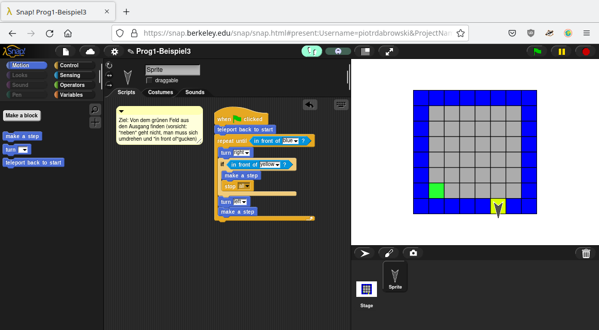
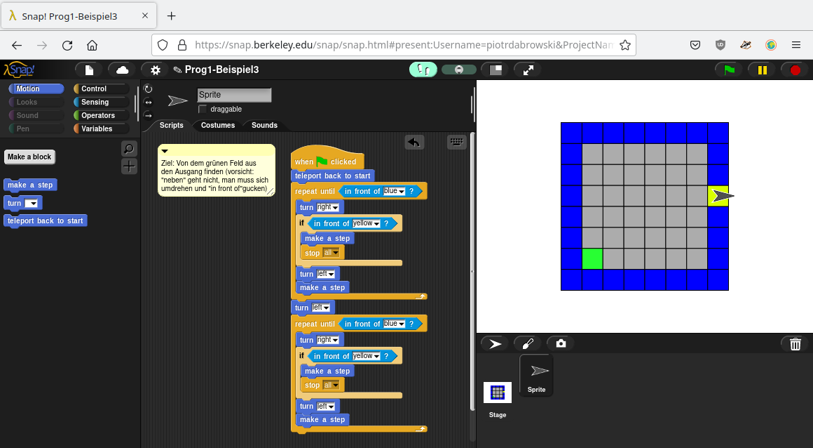
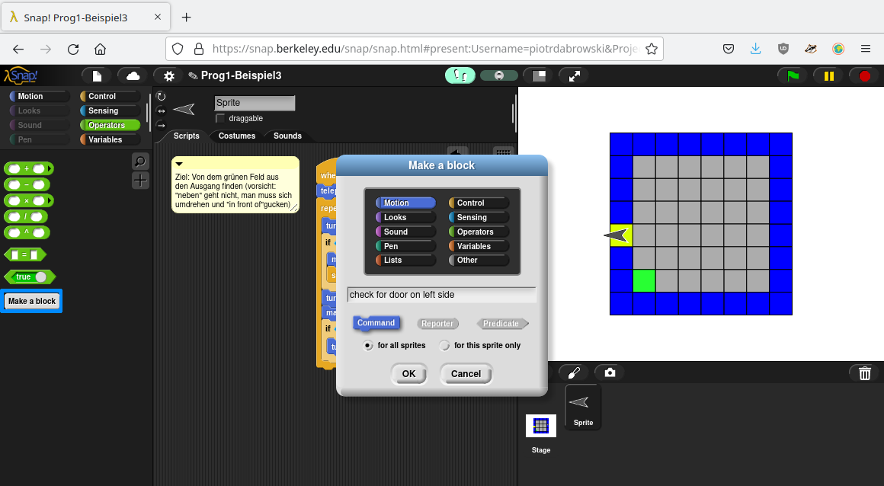
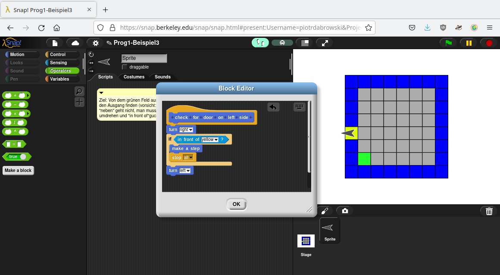

# Einführung in die Programmierung: Teil 2

Mit dem bisher erlangten Wissen können wir einige etwas komplexere Algorithmen entwickeln - und dabei ein paar weitere Blöcke kennenlernen. 

## Eine etwas komplexere Aufgabe

Zunächst schauen wir uns in [Beispiel 3](https://snap.berkeley.edu/project?user=piotrdabrowski&project=Prog1-Beispiel3) eine etwas komplexere Aufgabe an: Hier soll, ausgehend von dem grünen Feld, die Tür gefunden werden (also das gelbe Feld in der blauen Wand). Dabei darf aber die Wand natürlich nicht betreten werden. Also muss in jedem Schritt überprüft werden, ob der Pfeil gerade neben der Wand steht. Da die einzige vorhandene Überprüfung `in front of` ist, sind dafür drei Operationen nötig: Nach rechts drehen, überprüfen ob der Pfeil vor einem gelben Feld steht und, falls nein, wieder nach links drehen. In Snap! sieht das wie folgt aus:

## True und False

Das funktioniert allerdings nur, wenn die Tür an der ersten Wand ist. Um alle Wände abzusuchen, müsste die Schleife 4 Mal hintereinander wiederholt werden, und dawzischen müsste sich der Pfeil jedes Mal nach links drehen. Exemplarisch für die ersten 2 Wände (also nur mit einer Drehung) würde das so aussehen:

Natürlich ist das keine besonders praktikable Herangehensweise. Stattdessen wäre es praktischer, die erste Schleife gar nicht unterbrechen zu lassen und stattdessen sich nur, wenn der Pfeil vor der Wand steht, eine Drehung nach links zu machen. Dafür müsste man eine Bedingung für die Schleife finden, die immer erfüllt ist. Das ließe sich beispielsweise über einen Vergleich erreichen - `repeat until 1=0` würde immer wieder wiederholt werden (das können Sie selber mit dem grünen `=`-Block aus der Kategorie "Operators" ausprobieren). Das funktioniert, denn die Aussage "1=0" ist nie erfüllt, also immer falsch. Einfacher ist es also, direkt den Wert "falsch", in der Englisch-basierten Informatik `false`, zu verwenden (auch diesen Block finden Sie unter "Operators", er lässt sich per Klick zwischen `true` und `false` umschalten um jeweils eine immer erfüllte oder eben eine nie erfüllte Bedingung zu haben). Mit diesem Konzept lässt sich eine Endlosschleife erstellen, mit der der Pfeil immer der Wand entlang läuft, bis er eine Tür findet:

## Definieren eigener Funktionen

Dieses Programm funktioniert zwar an sich, ist aber nicht besonders einfach zu lesen: Wenn Sie einfach nur diesen Codeblock sehen würden:

würde es Ihnen vermutlich recht schwer fallen, nachzuvollziehen, was hier eigentlich passiert. Mit steigender Länge und Komplexität des Programms wird es immer schlimmer. Um dieses Problem zu beheben, und um ein Mal geschriebene Funktionalität immer wieder verwenden zu können, ist es möglich, eigene Funktionen zu schreiben - in Snap! abgebildet als das Erstellen eigener Blöcke. 

Eine Funktion sollte generell eine bestimmte, klar definierte Aufgabe übernehmen. Eine solche Aufgabe in dem Skript zur Suche nach der Tür ist, zu schauen, ob der Pfeil gerade neben der Tür steht (also: umdrechen nach rechts, falls da ein gelbes Feld ist einen Schritt machen und das Programm beenden, sonst wieder nach links umdrehen). Wenn man das alles in einen Block `check for door on right side` auslagern könnte, wäre der Code gleich viel übersichtlicher.

In Snap! kann man eine eigene Funktion definieren, indem man auf den Button "Make a block" unter der Block-Liste links klickt. Dann muss man oben eine Block-Kategorie auswählen (in diesem Fall wäre "Motion" eine sinnvolle Einordnung, aber auch "Sensing" wäre plausibel), dadrunter den Block-Namen eingeben und zuletzt dadrunter den Block-Typ auswählen (in unserem Fall "Command", um die anderen Typen kümmern wir uns später):

Wenn man nun mit OK bestätigt, kann man in dem neu erscheinenden Block Editor definieren, was in der Funktion passieren soll - genau so, wie es in dem Hauptskript auch passiert, nur dass der erste Block nun nicht `when start clicked` ist sondern als "Wenn der Block mit diesem Namen ausgeführt wird" zu verstehen ist. Zu dem Block Editor kommt man übrigens auch, wenn man auf einen selbst definierten Block rechts klickt und "Edit" auswählt.

Nun können wir in dem Block Editor definieren, dass in der Funktion `check for door on lerightft side` genau das passieren soll, was wir in dem Hauptskript getan haben, um nach einer Tür zu schauen:

Nach dem Speichern der Blockdefinition durch Klick auf den "OK"-Button kann der entsprechende Teil des Codes im Skript gelöscht und durch diesen neuen Block (der in der entsprechenden Kategorie, in diesem Beispiel unter "Motion", zu finden ist) ersetzt werden:

Das sieht schon übersichtlicher aus. Das gleiche könnte man auch für die Überprüfung, ob der Pfeil gerade vor der Wand steht und sich entsprechend nach links drehen sollte, tun (also die entsprechenden Anweisungen in einen Block `turn left if in front of wall` auslagern). Dann sieht das Skript so aus:

Hier ist schon eher auf Anhieb erkennbar, was das Skript tun soll.