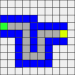
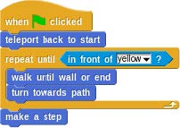

# Woche 1: Grundlegende Algorithmen mit Snap!

Willkommen in Programmierung 1! Auch wenn diese ersten Übungen mit Snap! sehr einfach aussehen: Hier geht es um den Kern der Programmierung. Denn die Programmiersprache ist eigentlich egal: Wenn Sie in der Lage sind, die Lösung für ein Problem im Kopf klar zu formulieren, dann ist es egal, in welcher Programmiersprache Sie sie nachher aufschreiben.

## Aufgabe 0

Legen Sie sich zunächst bei [Snap!](https://snap.berkeley.edu/) einen Account an. Diesen brauchen Sie, um die Aufgaben abzugeben - denn Sie sollen die Aufgaben in Moodle als Link zu einem Snap!-Projekt in Ihrem Profil abgeben. Wie Sie an diesen Link kommen, können Sie in [diesem Video](https://mediathek.htw-berlin.de/video/Abgaben-mit-Snap/4a4e1bb9eda16da2113f1741b688e3a2) sehen.

## Aufgabe 1

In dieser [ersten Aufgabe](https://snap.berkeley.edu/project?user=piotrdabrowski&project=Prog1-Uebung1.1) erstellen Sie einen ganz einfachen Algorithmus, um den Pfeil von dem grünen Feld (links) zum gelben Feld (rechts) zu bringen. Dabei soll der Pfeil nur über graue Felder laufen:

Verwenden Sie dafür zunächst nur die folgenden Blöcke:

* `when start clicked`
* `make a step`
* `turn`
* `teleport back to start`

## Aufgabe 2

In der [zweiten Aufgabe](https://snap.berkeley.edu/project?user=piotrdabrowski&project=Prog1-Uebung1.2) verallgemeinern Sie den Algorithmus aus Aufgabe 1. Sie dürfen nun zusätzlich die folgenden Blöcke verwenden:

* `if`
* `repeat until`
* `stop all`
* `in front of`

Gehen Sie am besten in zwei Schritten vor:

### Aufgabe 2.1

Schreiben Sie einen Algorithmus unter Verwendung der neuen Blöcke, der für die Karte aus Aufgabe 1 funktioniert.

### Aufgabe 2.2

Testen Sie Ihren Algorithmus mit der zweiten Karte (Rechtsklick auf die Karte -> edit, dann den Tab "Backgrounds" auswählen, die untere Karte anklicken, dann auf der rechten Seite unter der Karte den Pfeil "Sprite" auswählen und wieder zum Tab "Scripts" zurückwechseln):

### Aufgabe 3
Schreiben Sie für diese letzte Aufgabe nun Ihre Lösung mit Hilfe von neuen Blöcken, um sie übersichtlicher zu gestalten. Das Skript soll am Ende so aussehen:

Sie müssen also mindestens die zwei Blöcke `walk until wall or end` (läuft, bis der Pfeil vor einer Wand oder vor dem gelben Feld ist) sowie `turn towards path` (dreht den Pfeil so, dass er in die Richtung zeigt, in die er weiterlaufen sollte) implementieren.

Sie dürfen nun zusätzlich die folgenden Blöcke verwenden, welche zwei Bedingungen miteinander verknüpfen bzw. die Bedingung verneinen:

* `and`
* `or`
* `not`

Hier gibt es mehrere Lösungsansätze - je nach Ansatz werden Sie nicht unbedingt alle Ihnen zur Verfügung stehenden Blöcke benötigen.

Testen Sie Ihre Lösung wie vorher auch mit der alternativen Karte.