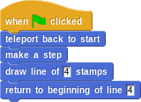

## Aufgabe 1

Schreiben Sie für diese [Aufgabe](https://snap.berkeley.edu/project?user=piotrdabrowski&project=Prog1-Uebung1.3) nun Ihre Lösung mit Hilfe von neuen Blöcken, um sie übersichtlicher zu gestalten. Das Skript soll am Ende so aussehen:

Sie müssen also mindestens die zwei Blöcke `walk until wall or end` (läuft, bis der Pfeil vor einer Wand oder vor dem gelben Feld ist) sowie `turn towards path` (dreht den Pfeil so, dass er in die Richtung zeigt, in die er weiterlaufen sollte) implementieren.

Sie dürfen nun zusätzlich die folgenden Blöcke verwenden, welche zwei Bedingungen miteinander verknüpfen bzw. die Bedingung verneinen:

* `and`
* `or`
* `not`

Hier gibt es mehrere Lösungsansätze - je nach Ansatz werden Sie nicht unbedingt alle Ihnen zur Verfügung stehenden Blöcke benötigen. 

Testen Sie Ihre Lösung wie vorher auch mit der alternativen Karte.

## Aufgabe 2

Ergänzen Sie die Lösung der letzten Aufgabe um das Zählen von Schritten: Fügen Sie eine Ausgabe hinzu, so dass der Pfeil am Ende (wenn er auf dem gelben Feld steht) für 2 Sekunden sagt: "Took X steps to find the exit", wobei `x` die Anzahl an gemachten Schritten sein soll. Sie finden die Aufgabe mit den dafür nötigen Blöcken [hier](https://snap.berkeley.edu/project?user=piotrdabrowski&project=Prog1-Uebung2). Implementieren Sie das auf zwei Arten:

## Aufgabe 2.1

Lösen Sie die Aufgabe, indem Sie eine Zählvariable einführen und diese nach jedem Schrritt um 1 erhöhen (also indem Sie Ihre Lösung der Aufgabe 2 von letzter Woche anpassen)

## Aufgabe 2.2

Lösen Sie die Aufgabe, indem Sie den neuen Block `walk until wall or end` aus Aufgabe 1 dieser Woche so anpassen, dass sie:

* die Anzahl der bisher gemachten Schritte als Argument bekommt,
* intern die Anzahl der gemachten Schritte mitzählt und
* die neue Anzahl an gemachten Schritten zurückgibt.

Das Skript am Ende sollte also so aussehen:

# Aufgabe 3

Mit dem Block `stamp` (zu finden in der Kategorie `Pen`) können Sie einen Stempel des Sprites auf dem aktuellen Feld hinterlassen.

Schreiben Sie ein Skript, welches das folgende Muster erzeugt:

Erstellen Sie dafür zwei neue Blöcke: `draw line of x stamps`, welcher `x` Stempel hintereinander erzeugt, sowie `return to beginning of line x`, welcher den Pfeil wieder an den Anfang der Zeile dadrunter bringt (also: Wenn Sie eine Zeile von 4 Stempeln erzeugt haben, sollte `return to beginning of line 4` den Cursor in die Zeile dadrunter bringen, und dafür 4 Schritte zurück laufen). Das Skript, um das obige Bild zu erzeugen (wobei der untere Pfeil kein Stempel ist, sondern der Cursor), sollte also so aussehen:

# Aufgabe 4

Erzeugen Sie nun das folgende Muster (Sie brauchen dafür keine weiteren Custom-Blöcke, verwenden Sie die beiden neuen Blöcke aus Aufgabe 5 weiter):

# Aufgabe 5

Erzeugen Sie nun das folgende Muster (Sie brauchen dafür keine weiteren Custom-Blöcke, verwenden Sie die beiden neuen Blöcke aus Aufgabe 5 weiter):

