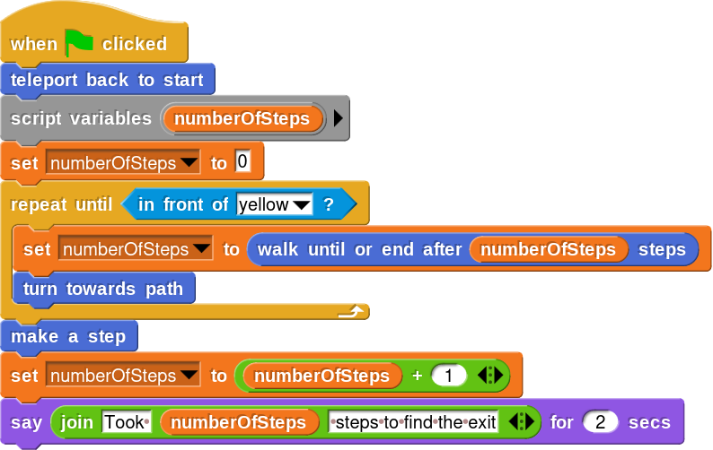
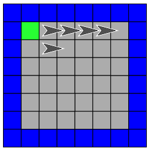
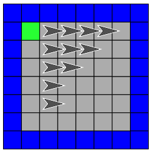

# Snap!-Aufgaben

Wir beginnen mit ein paar 

## Snap!-Aufgabe 1

Lösen Sie die Aufgabe, indem Sie den neuen Block `walk until wall or end` aus Aufgabe 1 der letzten WocheWoche so anpassen, dass sie:

* die Anzahl der bisher gemachten Schritte als Argument bekommt,
* intern die Anzahl der gemachten Schritte mitzählt und
* die neue Anzahl an gemachten Schritten zurückgibt.

Das Skript am Ende sollte also so aussehen:



## Snap!-Aufgabe 2

Mit dem Block `stamp` (zu finden in der Kategorie `Pen`) können Sie einen Stempel des Sprites auf dem aktuellen Feld hinterlassen.

Verwenden Sie für die nächsten Aufgaben [diesen Link](https://snap.berkeley.edu/project?user=piotrdabrowski&project=Prog1-Uebung3), wo die entsprechenden Blöcke freigeschaltet sind.

Schreiben Sie ein Skript, welches das folgende Muster erzeugt:



Erstellen Sie dafür zwei neue Blöcke: `draw line of x stamps`, welcher `x` Stempel hintereinander erzeugt, sowie `return to beginning of line x`, welcher den Pfeil wieder an den Anfang der Zeile dadrunter bringt (also: Wenn Sie eine Zeile von 4 Stempeln erzeugt haben, sollte `return to beginning of line 4` den Cursor in die Zeile dadrunter bringen, und dafür 4 Schritte zurück laufen). Das Skript, um das obige Bild zu erzeugen (wobei der untere Pfeil kein Stempel ist, sondern der Cursor), sollte also so aussehen:


## Snap!-Aufgabe 3

Erzeugen Sie nun das folgende Muster (Sie brauchen dafür keine weiteren Custom-Blöcke, verwenden Sie die beiden neuen Blöcke aus Aufgabe 5 weiter):


## Snap!-Aufgabe 4

Erzeugen Sie nun das folgende Muster (Sie brauchen dafür keine weiteren Custom-Blöcke, verwenden Sie die beiden neuen Blöcke aus Aufgabe 5 weiter):




# Java-Aufgaben

## Arbeiten mit VPL & Aufgabe 1

Ab dieser Übung sind die Hausaufgaben, die Sie abgeben, tatsächliche funktionsfähige Java-Programme. Sie können (und sollten sogar - das macht für Sie das Arbeiten deutlich einfacher und entspricht der Umgebung, in der Sie in der Zukunft auch arbeiten werden) die Lösungen mit einer IDE (z.B. Eclipse) auf Ihrem eigenen Computer entwickeln und testen. Die Abgabe erfolgt allerdings über das Virtual Programming Lab (VPL) in Moodle.

Sehen Sie sich das [Einführungvideo zu VPL](https://mediathek.htw-berlin.de/video/Einfuehrung-in-VPL-fuer-Programmierung-1/0cfead9e057316f6d3b9a76a8908ba66) an und geben Sie ein Java-Programm, das den Text ``Hello, world!'' ausgibt, als VPL-Übung 3.1 ab.

## Aufgabe 2

Schreiben Sie in Java ein Programm, das auf der Kommandozeile exakt die folgenden vier Zeilen in ausgibt (beachten Sie, dass nach der letzten Zeile *eine neue Zeile beginnt, in der aber nichts mehr steht*):

```text
*******
.......
*******
.......

```

Verwenden Sie für die Lösung mindestens eine Schleife und schreiben Sie in jeder `System.out.print` bzw. `System.out.println`-Anweisung nur ein Zeichen (`System.out.println("*")` ist also OK, `System.out.println("**")` ist nicht OK), schreiben also Sie **nicht** einfach explizit alle auszugebenden Zeilen in das Programm!

Geben Sie das Programm als VPL-Hausaufgabe 2 ab.

## Aufgabe 3

Schreiben Sie in Java ein Programm, das auf der Kommandozeile exakt die folgenden vier Zeilen in ausgibt (beachten Sie, dass nach der letzten Zeile *eine neue Zeile beginnt, in der aber nichts mehr steht*):

```text
*******
******
.....
****
***
**
*

```

Verwenden Sie für die Lösung mindestens eine Schleife und schreiben Sie in jeder `System.out.print` bzw. `System.out.println`-Anweisung nur ein Zeichen (`System.out.println("*")` ist also OK, `System.out.println("**")` ist nicht OK), schreiben also Sie **nicht** einfach explizit alle auszugebenden Zeilen in das Programm!

Geben Sie das Programm als VPL-Hausaufgabe 3 ab.

## Aufgabe 4

Schreiben Sie in Java ein Programm, das auf der Kommandozeile exakt die folgenden vier Zeilen in ausgibt (beachten Sie, dass nach der letzten Zeile *eine neue Zeile beginnt, in der aber nichts mehr steht*):

```text
*
**
***
****
*****
****
***
**
*

```

Verwenden Sie für die Lösung mindestens eine Schleife und schreiben Sie in jeder `System.out.print` bzw. `System.out.println`-Anweisung nur ein Zeichen (`System.out.println("*")` ist also OK, `System.out.println("**")` ist nicht OK), schreiben also Sie **nicht** einfach explizit alle auszugebenden Zeilen in das Programm!

Geben Sie das Programm als VPL-Hausaufgabe 4 ab.

## Aufgabe 5

Schreiben Sie in Java ein Programm, das auf der Kommandozeile exakt die folgenden vier Zeilen in ausgibt (beachten Sie, dass nach der letzten Zeile *eine neue Zeile beginnt, in der aber nichts mehr steht*):

```text
*.*.*.*.*
.*.*.*.*.      
*.*.*.*.*
.*.*.*.*.      
*.*.*.*.*
.*.*.*.*.      
*.*.*.*.*
.*.*.*.*.      
*.*.*.*.*

```

Verwenden Sie für die Lösung mindestens eine Schleife und schreiben Sie in jeder `System.out.print` bzw. `System.out.println`-Anweisung nur ein Zeichen (`System.out.println("*")` ist also OK, `System.out.println("**")` ist nicht OK), schreiben also Sie **nicht** einfach explizit alle auszugebenden Zeilen in das Programm!

Geben Sie das Programm als VPL-Hausaufgabe 5 ab.